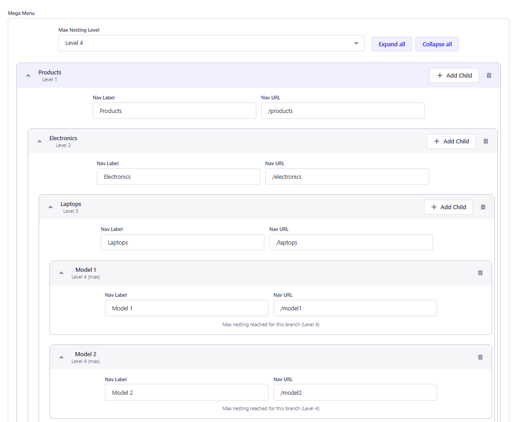
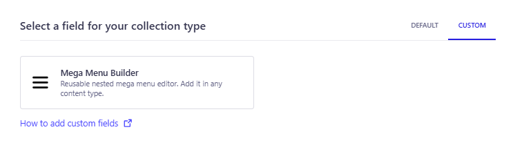
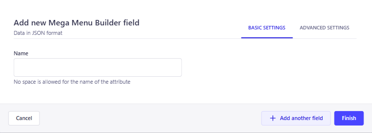

<p align="center">
  
</p>
<h1 align="center">Strapi ➕ Mega Menu Builder</h1>

<p align="center">
  Reusable nested mega menu custom field for Strapi v5.
</p>

## 👋 Get Started

- [Features](#features)
- [Installation](#installation)
- [Usage](#usage)
- [Configuration](#configuration)
- [Frontend Integration](#frontend-integration)
- [Validation Rules](#validation-rules)
- [Requirements](#requirements)

## <a id="features"></a>✨ Features

- Nested menu tree editor as a Strapi custom field
- Configurable max nesting depth (Level 1 to Level 4)
- Drag-and-drop style hierarchy editing inside the field UI
- Collapse / Expand support for large menu trees
- Basic title and URL constraints for cleaner menu data
- JSON output that can be saved directly in content entries

## <a id="installation"></a>🔧 Installation

Add the plugin to your Strapi application:

```bash
npm install @_ns/strapi-plugin-mega-menu
```
    or
```bash
yarn add @_ns/strapi-plugin-mega-menu
```

Then rebuild the admin panel:

```bash
npm run build
```
    or
```bash
yarn build
```

Quick start (development):

```bash
npm run develop
```
    or
```bash
yarn develop
```

For local plugin development inside `src/plugins/mega-menu`, Strapi auto-loads the plugin.

## <a id="usage"></a>✍️ Usage

The plugin is available as a **Custom Field** in Content-Type Builder.

1. Open **Content-Type Builder**.
2. Add a new field and go to the **CUSTOM** tab.

<p align="center">
  
</p>

3. Select **Mega Menu Builder**.


<p align="center">
  
</p>

4. Save the content type and restart Strapi if required.


### Custom field details

- Plugin id: `mega-menu`
- Field name: `mega-menu-builder`
- Field type: `json`

### Example output (JSON)

```json
{
  "items": [
    {
      "id": "node_1776858560893_5eb921",
      "url": "/products",
      "title": "Products",
      "children": [
        {
          "id": "node_1776858589836_cb32c9",
          "url": "/electronics",
          "title": "Electronics",
          "children": [
            {
              "id": "node_1776858590572_88bfd9",
              "url": "/laptops",
              "title": "Laptops",
              "children": [
                {
                  "id": "node_1776858810835_f60e77",
                  "url": "/model1",
                  "title": "Model 1",
                  "children": []
                },
                {
                  "id": "node_1776858844971_6ed20e",
                  "url": "/model2",
                  "title": "Model 2",
                  "children": []
                }
              ]
            }
          ]
        }
      ]
    }
  ],
  "maxDepth": 4
}
```

### What editors can do in the field

- Add root menu items
- Add nested child items
- Set max depth for the menu tree
- Collapse/expand branches
- Reorder items before saving

> The plugin is configured to be used from the custom field flow.  
> No separate plugin page is required for editor usage.

## <a id="configuration"></a>⚙️ Configuration

The plugin does not require extra code-based setup in `src/admin/app.*`.
Configuration is done directly from the custom field UI.

### Field-level configuration

- **Max Nesting Level**: controls how deep menu hierarchy can go (`1` to `4`)
- **Node fields**:
  - `title` (menu label)
  - `url` (target path/link)
  - `children` (nested items array)

### Content-Type Builder setup

1. Open your collection type or single type.
2. Add custom field `Mega Menu Builder`.
3. Save changes and restart Strapi if prompted.
4. Use the field in Content Manager to build nested menu JSON.

## <a id="frontend-integration"></a>🌐 Frontend Integration

Fetch the content entry and render `megaMenu.items` recursively on your frontend.

```js
const renderMenu = (nodes = []) =>
  nodes.map((node) => ({
    label: node.title,
    href: node.url,
    children: renderMenu(node.children || []),
  }));

// Example usage with API response
const menuTree = renderMenu(response.data.megaMenu?.items || []);
```

`maxDepth` can be used as a UI guard if you allow menu editing on frontend.

## <a id="validation-rules"></a> ✅ Validation Rules

Menu item payload constraints:

- `title`: required, trimmed, max 120 chars
- `url`: required, trimmed, max 2048 chars

## <a id="requirements"></a>⚠️ Requirements

- Strapi `>= 5.0.0`
- Node.js `>= 20.0.0`

